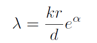
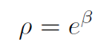
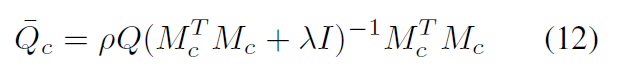

~~~python
FRN.forward_pretrain()

inp # [128, 3, 84, 84] 一个batch的图像

feature_map = self.get_feature_map(inp) #torch.Size([128, 25, 640]) # N,HW,C
# 每张图得到25个640维特征

feature_map = feature_map.view() #[3200, 640],该类别的所有图的特征都放在一个池子里

recon_dist = self.get_recon_dist(query,support,alpha,beta) # [3200, 64]
 	query: way*query_shot*resolution, d 
 	support: way, shot*resolution , d
 	query=feature_map,support=self.cat_mat,alpha=alpha,beta=beta
 	cat_mat在model初始化时定义，大小[64, 25, 640]，内容是随机生成的变量
 	self.cat_mat = nn.Parameter(torch.randn(self.num_cat,self.resolution,self.d),requires_grad=True) 
 	num_cat=64,是train_loader的类别数，
 	resolution在初始化时定义，self.resolution = 25，含义是H*W——特征提取后的图像是大小5*5*640
~~~

recon_dist，在batch_size=128时，[3200,64]，neg_l2_dist.size(): torch.Size([128, 64])

   

recon_dist = self.get_recon_dist(query=feature_map,support=self.cat_mat,alpha=alpha,beta=beta) #

feature_map [3200, 640]

cat_mat [64, 25, 640]

~~~python
FRN.get_recon_dist(self,query,support,alpha,beta,Woodbury=True)

reg = support.size(1)/support.size(2) # 25/640
lam = reg*alpha.exp()+1e-6  # lambda
rho = beta.exp()

st = support.permute(0,2,1) # way, d, shot*resolution

st = support.permute(0,2,1) # way, d, shot*resolution

if Woodbury:
    # correspond to Equation 10 in the paper
    sts = st.matmul(support) # way, d, d
    m_inv = (sts+torch.eye(sts.size(-1)).to(sts.device).unsqueeze(0).mul(lam)).inverse() 
    hat = m_inv.matmul(sts) # way, d, d
else:
    # correspond to Equation 8 in the paper
    sst = support.matmul(st) # way, shot*resolution, shot*resolution
    m_inv = (sst+torch.eye(sst.size(-1)).to(sst.device).unsqueeze(0).mul(lam)).inverse() # way, shot*resolution, shot*resolutionsf 
    hat = st.matmul(m_inv).matmul(support) # way, d, d
    Q_bar = query.matmul(hat).mul(rho) # way, way*query_shot*resolution, d
    dist = (Q_bar-query.unsqueeze(0)).pow(2).sum(2).permute(1,0) # way*query_shot*resolution, way
    return dist
~~~

sts 相当于$S^TS$，

~~~python
# FRN.py 的get_neg_l2_dist()
feature_map = self.get_feature_map(inp)

support = feature_map[:way*shot].view(way, shot*resolution , d)
query = feature_map[way*shot:].view(way*query_shot*resolution, d)

# 打个断点，在这里插入glofa
# ipdb.set_trace(context=40)

recon_dist = self.get_recon_dist(query=query,support=support,alpha=alpha,beta=beta) # way*query_shot*resolution, way
neg_l2_dist = recon_dist.neg().view(way*query_shot,resolution,way).mean(1) # way*query_shot, way
# 其实这里是两步操作，第一步得到[way*query_shot,resolution,way],代表每个通道的特征图的相似度
# 第二部计算每张图的相似性均值，也就是|Q_bar-Q|/r的操作

~~~

作者说pre-train是最重要的。假如在finetune加入MLP，应该在support和query上加。

但glofa的resnet是有avgpool的，最终的输出是1x640，而FRN的resnet没有avgpool，最终的输出是25x640。简单的做法是把25x640改成1x16000，但这不符合通道的特色。

用support计算task_mask，和全局的global_mask，

#### pre-train和fine-tune的区别

pre-train中的data_loader是dataloaders.normal_train_dataloader

fine-tune中是train_loader = dataloaders.meta_train_dataloader(data_path=pm.train,
                                                way=train_way,
                                                shots=shots,
                                                transform_type=args.train_transform_type)

FRN中的get_neg_l2_dist() 中的support和query的标签是什么，或者说，inp的标签是什么 

不必关心dataloader.py，不管怎么样，inp已经分为了【way,shot,d】，现在的问题是recon_dist 是什么含义，query为什么要打散成特征，一个1x640要查出来什么?

